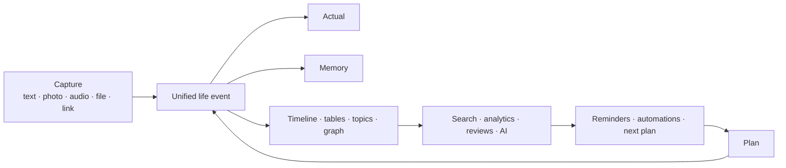

# Richangyu · Life Workbench

[简体中文](./README.md) · [3-minute walkthrough](#walkthrough) · [Visual guide](./docs/usage-guide.md) · [Local setup](#local-setup) · [Self-hosting](./docs/deployment-cloudflare.md) · [Contributing](./CONTRIBUTING.md)

An open-source, privacy-first and self-hostable personal life operating system. It connects what you planned, what actually happened, and how you later understand that part of your life.


## Walkthrough

[](https://me-fake-you.github.io/richangyu-life-workbench/)

The public player includes controls and Chinese captions. This three-minute walkthrough explains the plan–actual–memory model, Today workspace, batch scheduling, inbox, source-backed intelligence, meal-photo estimates, finance and side-hustle flow, mobile installation, and AI/privacy boundaries.

[Play online](https://me-fake-you.github.io/richangyu-life-workbench/) · [Download MP4](https://github.com/me-fake-you/richangyu-life-workbench/raw/refs/heads/main/public/tutorial/richangyu-quick-start.mp4) · [Chinese captions](./public/tutorial/richangyu-quick-start.vtt) · [Full chapter script](./docs/video-script.md)

## How the pieces connect



One real-world event is recorded once and then linked. A tutoring session can update work time, receivables, settlement, a real account transaction, the daily timeline, and a monthly review without duplicating the same story.

| Today dashboard | Batch scheduling |
| --- | --- |
|  |  |

| Intelligence center | Mobile PWA |
| --- | --- |
|  |  |

## Features

- **Today dashboard** with daily motivation, top three priorities, schedule, photos, mood, memories, and configurable cards.
- **Three-track time system** for plan, reality, and memory, including day, 3-day, week, month, semester, and timeline views.
- **Life records** with text, photos, backdating, drafts, revisions, inbox capture, global search, graph relations, and topic spaces.
- **Custom databases** with typed fields, formulas, relations, rollups, filters, grouping, batch operations, and multiple views.
- **Photos and nutrition** with albums, stories, duplicate/blur hints, metadata-safe sharing, meal photos, calorie estimates, and manual correction.
- **Finance and side hustles** with accounts, budgets, transactions, receivables, work sessions, settlements, costs, profit, and effective hourly rates.
- **Intelligence and opportunity radar** with domestic/international sources, research signals, job tracking, and daily briefings.
- **Reviews and automation** with source-backed daily, weekly, monthly, annual, and topic summaries.
- **Privacy and portability** with an isolated private vault, backup/restore preview, recycle bin, and JSON/CSV/Markdown/iCalendar import/export.
- **Installable PWA** with mobile editing, offline media queues, later synchronization, and conflict handling.

See [architecture](./docs/architecture.md) and [data and privacy](./docs/data-and-privacy.md) for implementation boundaries.

## Stack

React 19, Next.js-compatible routing, Vinext, Vite, TypeScript, Cloudflare Worker, D1, R2, Drizzle ORM, and optional NVIDIA or OpenAI-compatible AI providers.

## Local setup

Node.js `>= 22.13.0` is required.

```bash
git clone <your-repository-url>
cd richangyu-life-workbench
npm install
cp .env.example .env.local
npm run doctor
npm run dev
```

Core recording, calendar, table, and finance features do not require an AI key. Add a provider only for model-backed generation or vision analysis.

## AI providers

Secrets belong in `.env.local`, which is ignored by Git. NVIDIA text and vision models may use separate keys:

```env
AI_PROVIDER=nvidia
NVIDIA_TEXT_API_KEY=your-text-key
NVIDIA_VISION_API_KEY=your-vision-key
NVIDIA_MODEL=z-ai/glm-5.2
NVIDIA_VISION_MODEL=nvidia/nemotron-nano-12b-v2-vl
```

OpenAI is also supported:

```env
AI_PROVIDER=openai
OPENAI_API_KEY=your-key
OPENAI_MODEL=gpt-5-mini
OPENAI_VISION_MODEL=gpt-5-mini
```

A ChatGPT account used for site authentication does not automatically provide OpenAI API credits.

## Self-hosting

The supported standalone topology is Cloudflare Worker + D1 + R2. Follow the [Cloudflare deployment guide](./docs/deployment-cloudflare.md).

> A standalone Worker may be publicly reachable by default. Configure Cloudflare Access or equivalent authentication before storing real life, finance, or client data.

## Mobile

Richangyu is an installable Progressive Web App rather than an App Store APK/IPA. Open the same deployment URL on desktop and mobile to edit the same D1-backed data. On iOS use Safari's “Add to Home Screen”; on Android use “Install app”.

## Development

```bash
npm run validate
```

This runs type checks, linting, tests, and the production build. Read [CONTRIBUTING](./CONTRIBUTING.md), [SECURITY](./SECURITY.md), and the [changelog](./CHANGELOG.md) before submitting changes.

## Demo data

[`examples/demo`](./examples/demo/) contains fictional CSV, Markdown, and iCalendar files for import testing. Never commit real backups, photos, financial documents, or local environment files.

## Status and license

`v1.4.0` is the usability release: it adds simple/full workspace modes, six scene presets, a five-entry mobile navigation, unified text/voice/photo capture, multi-module command previews with immediate undo, and one-by-one inbox triage.

The next release should prioritize a resettable public demo, end-to-end coverage, backup/restore verification, sync conflict observability, deployment security checks, AI provenance, performance, and accessibility. Native mobile clients, multi-user collaboration, a third-party plugin marketplace, and medical-grade nutrition analysis remain outside the current release scope.

Licensed under the [MIT License](./LICENSE). Nutrition estimates are for personal logging only and are not medical advice.
