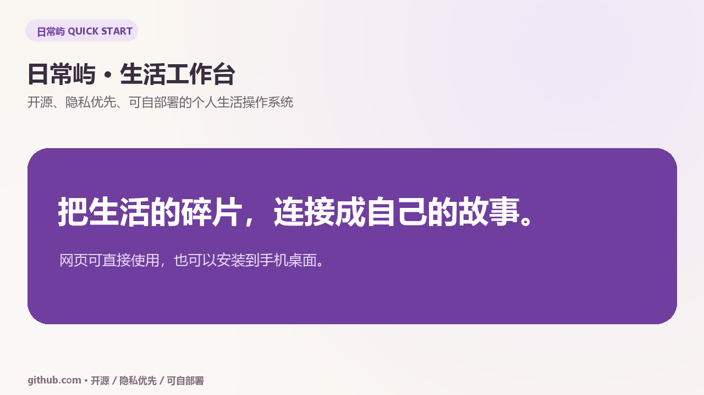
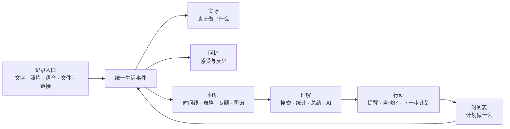

# 日常屿 · 生活工作台

## 2026-10-02 项目讲解与开发进度

- [新版中文项目讲解、AI 使用边界与升级路线](./docs/PROJECT-GUIDE-20261002.md)
- [小红书文案、配图与短视频拍摄方案](./docs/XIAOHONGSHU-20261002.md)
- [AI 升级草稿 PR #7](https://github.com/me-fake-you/richangyu-life-workbench/pull/7)：尚未合并；后续线上修复不自动等于公开分支已经同步。

本轮更新的是公开文档，不是新的 APK 或商店发布。主分支的既有版本说明见下文；手机形态仍应区分 PWA 与原生安卓。个人线上工作台及其数据保持私有。


[English](./README.en.md) · [三分钟产品讲解](#三分钟产品讲解) · [图文使用指南](./docs/usage-guide.md) · [本地运行](#本地运行) · [独立部署](./docs/deployment-cloudflare.md) · [参与贡献](./CONTRIBUTING.md)

[](./CHANGELOG.md)
[](./LICENSE)


一个开源、隐私优先、可自部署的个人生活操作系统。它把“计划要做什么、实际发生了什么、后来如何理解这段生活”连接在同一个工作台中。


## 三分钟产品讲解

[](https://me-fake-you.github.io/richangyu-life-workbench/)

点击封面进入带控制条和中文字幕的公开播放页。视频约三分钟，从“计划—实际—回忆”开始，依次演示今日工作台、批量日程、生活收件箱、情报中心、饮食记录、财务与兼职、手机安装，以及 AI 和隐私边界。

- [在线播放](https://me-fake-you.github.io/richangyu-life-workbench/)
- [下载 MP4](https://github.com/me-fake-you/richangyu-life-workbench/raw/refs/heads/main/public/tutorial/richangyu-quick-start.mp4)
- [完整旁白与章节](./docs/video-script.md)
- [中文字幕](./public/tutorial/richangyu-quick-start.vtt)
- [逐步图文使用指南](./docs/usage-guide.md)

## 一张图理解日常屿



同一件事只记录一次。例如完成一次家教后，工作时长进入兼职项目，应收款进入收款中心，真实到账才进入财务账户，同时在生活时间线留下记录；照片、地点、课程和反思都可以继续关联。

## 界面导览

| 今日工作台 | 批量时间安排 |
| --- | --- |
|  |  |
| 用一张首页查看激励、Top 3、日程、照片、心情和计划执行情况。 | 一次录入一天或一周的多项安排，分别设置日期、时间和分类。 |

| 情报中心 | 手机端 |
| --- | --- |
|  |  |
| 从国内外公开来源提炼热点、研究信号与行动建议，并保留原文入口。 | 安装到主屏幕后以独立窗口运行，常用入口集中在底部导航。 |

| 饮食与营养 | 开始使用 |
| --- | --- |
|  | [](https://me-fake-you.github.io/richangyu-life-workbench/) |
| 上传三餐照片后确认食物和份量，保存热量、营养素与长期趋势。 | 视频、中文字幕、站内指南与图文手册共同覆盖第一次使用。 |

## 第一次使用：五分钟完成一个闭环

1. 先在“我的”选择“简洁模式”和最接近自己的场景，日常只保留必要入口。
2. 在“今日”点击“记录此刻”，写下一件今天真实发生的事。
3. 进入“时间表中心”，给明天安排一段时间；一天有多项安排时使用批量录入。
4. 来不及整理的文字、照片或链接先放进“生活收件箱”，之后用“逐条整理”清空。
5. 日程结束后补充实际开始、实际时长、结果和感受；周末在“回顾”检查来源并保存总结。

如果找不到入口，按 `Ctrl/⌘ + K` 使用全局指令，例如：

```text
明天晚上 7 点安排一小时英语学习
记录今天第一次给初一三班上 Python 课，心情很好
午饭花了 32 元
午饭鸡肉饭，花了 32 元，心情不错
建立一个教资错题表
```

最后一个例子会先显示执行预览，确认后一次写入饮食、财务和生活记录；执行完成页仍可立即撤销。指令栏也支持上传一张照片，浏览器支持时可直接语音输入。

## 为什么做它

日常屿不是把日记、日历和表格简单堆在一起。所有内容都可以成为一条“生活事件”，并与时间、照片、人物、地点、目标、财务、课程、兼职或专题建立关系。它适合长期记录，也适合教师、研究生、自由职业者和希望认真整理生活的人。

它试图解决四个连续问题：

| 层次 | 要回答的问题 | 主要模块 |
| --- | --- | --- |
| 记录 | 今天发生了什么？ | 图文记录、照片、收件箱、饮食、文件 |
| 组织 | 这些内容属于哪里？ | 时间线、日历、表格、专题、图谱 |
| 理解 | 时间和精力去了哪里？ | 搜索、统计、回顾、计划与实际、AI |
| 行动 | 下一步真正重要的是什么？ | 时间表、目标、提醒、自动化、情报行动 |

## 功能概览

- **今日工作台**：动态问候、每日激励、Top 3、日程、照片、心情、往年今日；卡片可拖动、缩放、隐藏。
- **简洁/完整工作台**：默认只保留日常主线，根据日常、教师、科研、兼职、健康或财务场景显示常用模块；完整功能始终可以展开。
- **三轨时间系统**：计划、实际与回忆；今日、三日、周、月、学期和时间轴视图，重复日程、课程表、提醒和冲突检查。
- **记录与组织**：图文记录、补记、草稿、版本历史、生活收件箱、全局搜索、生活图谱、专题空间和多工作台。
- **自定义表格库**：字段、公式、关联与汇总、筛选、排序、分组、批量操作，以及表格、看板、日历、时间线、相册和图表视图。
- **照片与饮食**：相册、照片故事、重复/模糊提示、无 EXIF 分享；三餐照片、热量和营养素估算、人工校正与趋势。
- **财务与兼职**：账户、预算、收支、转账、退款、报销、储蓄目标；兼职打卡、应赚/到账分离、应收款、成本、净利润和有效时薪。
- **情报与机会**：国内外信息源、研究雷达、岗位追踪、每日简报和外部资料收藏；重要信息可转为任务、专题或记录。
- **回顾与自动化**：日/周/月/年及专题总结、计划与实际分析、来源回溯、纪念日提醒、周期任务和后台 AI 队列。
- **隐私与可迁移性**：私密空间隔离、独立导出确认、回收站、自动备份、JSON/CSV/Markdown/iCalendar 导入导出和恢复预检。
- **移动端 PWA**：手机浏览器访问，可安装到主屏幕；“＋”提供文字、拍照、语音、饮食、收件箱和更多指令，照片上传前在本机压缩，离线重开后仍可继续记录。
- **单手与跨设备体验**：底部快捷入口可配置，时间表横向滑动吸附，保存按钮固定在拇指区域，同步状态直接显示，私密空间切后台自动锁定。
- **统一快捷记录**：文字、语音和照片进入同一个指令入口；一句话可拆成多项动作，先预览、后确认，并支持立即撤销。
- **长期可靠性**：数据健康评分、数据库关联检查、附件存在性检查、私有云端快照、只读恢复演练、同步诊断和安全演示模式。

更完整的技术边界与数据流见[架构说明](./docs/architecture.md)和[数据与隐私](./docs/data-and-privacy.md)。

## 功能成熟度

图标含义：✅ 可直接使用；🧪 需要配置或仍在增强；🧭 计划方向。

| 领域 | 当前状态 | 说明 |
| --- | --- | --- |
| 记录、时间线、日历、搜索 | ✅ | 支持图文、补记、草稿、关联、收藏与回收站 |
| 时间表与课程表 | ✅ | 多视图、重复规则、批量安排、提醒、计划与实际 |
| 自定义表格与专题 | ✅ | 字段、模板、筛选、排序、分组、公式、关联与多视图 |
| 财务与兼职 | ✅ | 账户、交易、预算、应收、结算、成本、利润与真实时薪 |
| 相册与饮食 | ✅ / 🧪 | 照片整理可用；视觉营养估算需要配置视觉模型并人工确认 |
| 情报、研究与求职 | 🧪 | 公开来源读取可用；AI 提炼、定时刷新与部分来源依赖部署配置 |
| AI 总结与生活问询 | 🧪 | 需要文字模型；结果保留来源，写入前由用户确认 |
| PWA 与离线队列 | ✅ | 可安装到主屏幕；离线队列不是长期备份 |
| 多人协作、原生客户端、插件市场 | 🧭 | 不在当前稳定版本承诺范围内 |

## 四个典型使用场景

### 教学与学习

课程表安排单双周课程，课后填写实际时长与教学反思；课程、教案、课堂照片和反思自动进入同一专题，学期末生成教师成长档案。

### 兼职与财务

兼职打卡记录工作内容与隐性时间，应收款跟踪未到账收入，结算后写入真实财务账户，项目看板持续计算成本、净利润和有效时薪。

### 饮食与健康记录

上传早餐、午餐、晚餐照片，确认食物、份量和烹饪方式；系统保存热量与营养素估算，并在周/月趋势中回看。估算结果不用于诊断或治疗。

### 情报与研究

情报中心读取国内外公开来源，保留原始链接；AI 只负责提炼、关联和提出下一步，重要信息可以转为精读任务、研究专题或求职行动。

## 技术栈

- React 19、Next.js 16 兼容路由、Vinext、Vite、TypeScript
- Cloudflare Worker、D1、R2、Drizzle ORM
- PWA、Service Worker、本地离线队列
- 可选 NVIDIA 或 OpenAI 兼容模型接口

## 本地运行

要求 Node.js `>= 22.13.0`。

```bash
git clone <你的仓库地址>
cd richangyu-life-workbench
npm install
cp .env.example .env.local
npm run doctor
npm run dev
```

Windows PowerShell 可用：

```powershell
Copy-Item .env.example .env.local
npm run doctor
npm run dev
```

开发服务器启动后访问终端显示的本地地址。未配置 AI 密钥时，记录、时间表、表格、财务等核心功能仍可使用；需要视觉识别或模型生成时再配置模型。

## AI 配置

密钥只写入 `.env.local`，该文件已被 Git 忽略。

NVIDIA 的文字与视觉模型可以使用两把不同的密钥：

```env
AI_PROVIDER=nvidia
NVIDIA_TEXT_API_KEY=你的文字模型密钥
NVIDIA_VISION_API_KEY=你的视觉模型密钥
NVIDIA_MODEL=z-ai/glm-5.2
NVIDIA_VISION_MODEL=nvidia/nemotron-nano-12b-v2-vl
```

也可选择 OpenAI：

```env
AI_PROVIDER=openai
OPENAI_API_KEY=你的密钥
OPENAI_MODEL=gpt-5-mini
OPENAI_VISION_MODEL=gpt-5-mini
```

ChatGPT 登录用于站点身份验证时，不等于自动获得 OpenAI API 调用额度。AI 生成内容会保留来源，写入正式记录前应由用户确认。

| 能力 | 推荐配置 | 没有模型时 |
| --- | --- | --- |
| 标题、标签、日周月总结、自然语言指令 | 文字模型 | 仍可手动记录、搜索和统计 |
| 餐食照片、票据、截图与资料识别 | 视觉模型 | 仍可手动填写食物、金额和备注 |
| 热点与研究简报 | 公开来源 + 文字模型 | 仍可阅读和收藏原始来源 |

密钥只在服务端读取，绝不能写进客户端代码、README、截图、备份或公开仓库。完整边界见[数据与隐私说明](./docs/data-and-privacy.md)。

## 独立部署

项目支持 Cloudflare Worker + D1 + R2 自部署。完整步骤见[Cloudflare 独立部署指南](./docs/deployment-cloudflare.md)。

```bash
npm run build
npm run cloudflare:configure
npm run cloudflare:migrate
npx wrangler deploy --config dist/server/wrangler.self-host.json
```

> 重要：独立部署后的 Worker 默认可能可被公网访问。存放真实生活、财务或客户数据前，必须配置 Cloudflare Access 或等效身份验证，并完成备份验证。

## 移动端

它是可安装网页应用（PWA），不是商店里的原生 APK/IPA。电脑和手机打开同一个已部署网址即可编辑同一份 D1 数据。

- iPhone：Safari → 分享 → 添加到主屏幕。
- Android：Chrome/系统浏览器 → 安装应用或添加到主屏幕。
- 手机首次访问会显示安装提示；也可以在“我的 → 手机应用体验”中重新查看步骤。
- 点击底部“＋”可直接写一句话、拍照、录音、记录饮食或打开收件箱；长按“＋”会优先显示语音入口。
- “我的 → 工作台模式与场景”可以把底部“回顾”替换为收件箱、相册、财务、饮食或兼职。
- 离线时可重新打开已缓存的应用外壳，新建的图文记录会进入本地队列，联网后同步。
- 顶部同步状态会直接显示“已同步、离线、待同步或需处理”，点击即可重试。
- 安装后长按应用图标，可直接记录生活、安排日程、记录饮食或打开收件箱。

手机端和电脑端同步的前提是：访问同一套已部署服务、通过同一身份进入、并且部署已正确绑定同一 D1/R2。浏览器本地开发数据不会自动同步到线上环境。

## 演示数据

进入“我的 → 数据健康与恢复演练”旁边的“安全演示模式”，可以一键加入时间表、生活记录、表格、财务、兼职、应收和饮食等虚构数据。重置只会删除带 `demo-v13-` 前缀的演示内容，不会触碰真实记录。

[`examples/demo`](./examples/demo/) 仍提供虚构的 CSV、Markdown 和 iCalendar 文件，用于体验导入中心。请勿把自己的真实备份、照片或 `.env.local` 提交到公开仓库。

## 数据健康与恢复演练

“我的”页面会给出数据健康分数，并分别检查：

- D1 数据表、总行数与外键关联；
- R2 照片和附件引用是否仍有原文件；
- 最近备份时间、失败历史和快照文件数；
- 本机离线队列、云端同步回执和冲突；
- AI 后台任务的运行与失败状态。

“创建云端快照”会在私有对象存储中保存数据清单和附件副本；“恢复演练”只读校验最近快照、附件副本和 SHA-256 校验和，不会写回正式数据。完整说明见[长期可靠性指南](./docs/reliability.md)。

## 项目结构

```text
app/                    页面、组件、样式与 API 路由
db/                     Drizzle 数据模型
drizzle/                D1 数据库迁移
worker/                 Cloudflare Worker 入口
public/                 PWA 资源、图标、讲解视频与字幕
docs/                   架构、隐私、部署、使用和发布说明
examples/demo/          完全虚构的导入演示数据
scripts/                环境检查、部署、开源导出与视频生成
tests/                  数据边界、回归、安全与开源检查
```

视频维护者可以阅读[讲解脚本](./docs/video-script.md)，重新生成旁白、字幕、封面和 MP4。界面截图位于 [`docs/images`](./docs/images/)。

## 开发与验证

```bash
npm run typecheck
npm run lint
npm test
npm run build
# 或一次执行全部
npm run validate
```

提交代码前请阅读[贡献指南](./CONTRIBUTING.md)和[安全政策](./SECURITY.md)。版本变化记录在[CHANGELOG](./CHANGELOG.md)。

## 项目状态

当前为 `v1.5.0` 移动优先版：在长期可靠性和简洁工作台基础上，加入六项快捷记录、可配置底部入口、相机/语音直达、离线重开、可见同步状态、手机通知设置、后台隐私锁定和按需加载。

下一阶段仍值得升级，但重点不应继续堆叠新模块，而应优先提高“长期真的敢用”的程度：

1. **真实端到端测试**：继续扩展到更多 Android/iOS 浏览器、相机/麦克风权限和弱网恢复场景。
2. **大数据性能**：大表格虚拟滚动、相册分页、搜索索引和低端手机内存控制。
3. **可选数据连接器**：在明确授权下导入浏览器收藏、ActivityWatch 或健康平台数据，而不是后台静默监控。
4. **安全加固**：部署时强制身份保护检查、可选客户端加密设计、敏感字段脱敏和会话审计。
5. **AI 可解释性**：继续完善来源、置信度、成本、失败重试和人工确认，不允许无来源内容自动写入正式数据。

原生客户端、多人协作、第三方插件市场和医疗级营养分析不在当前稳定版本承诺范围内。公开发布流程见[GitHub 发布说明](./docs/github-release.md)。

## 许可证

[MIT License](./LICENSE)。你可以学习、修改和自部署；若公开分发修改版本，请保留许可证与版权声明。

饮食图片的热量与营养结果仅用于日常记录估算，不能替代医生或注册营养师的意见。
