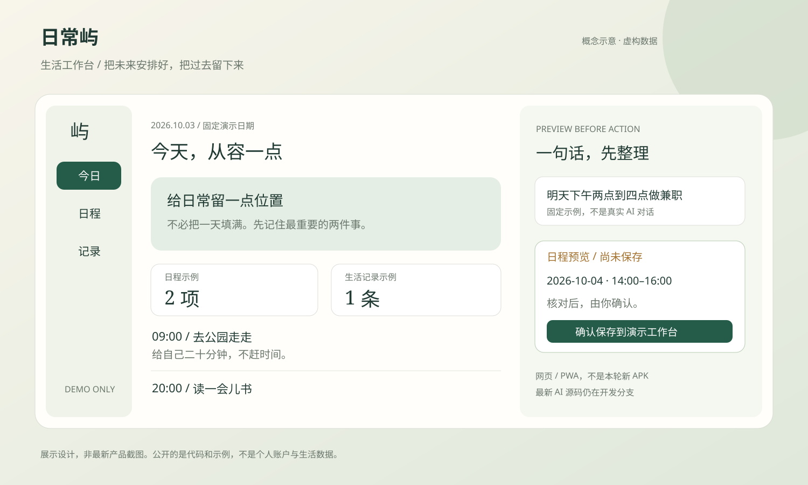
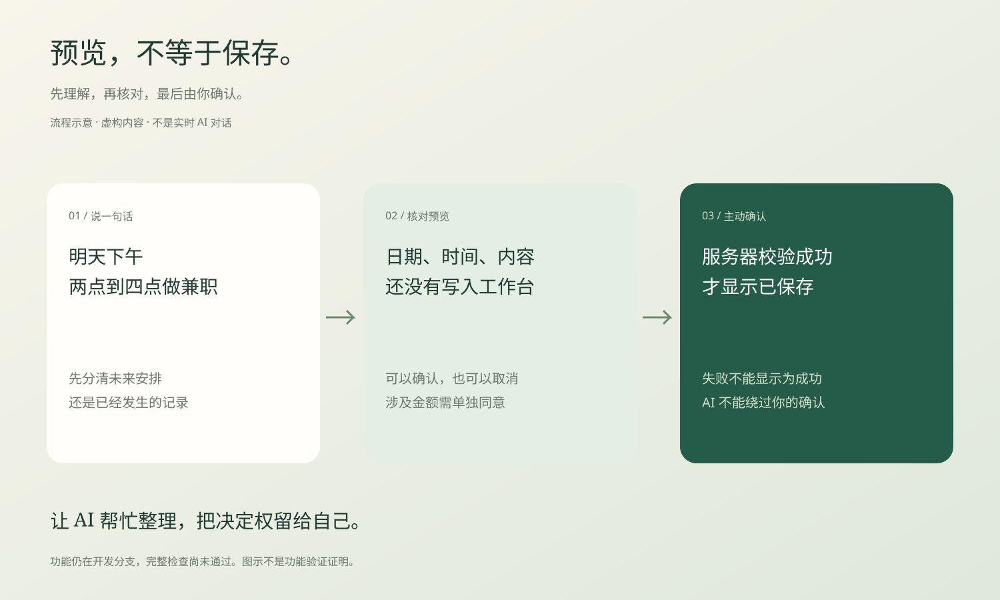

# 日常屿 · 生活工作台

**把想做的事安排好，把做过的事留下来。**

一个隐私优先、可以自行部署的个人生活工作台，也是一种“个人生活操作系统”：连接日程、生活记录与兼职管理。AI 的职责是整理建议，不是在你没有确认时擅自修改数据。



[产品讲解](docs/PROJECT-GUIDE-20261002.md) · [安卓下载状态](https://me-fake-you.github.io/richangyu-life-workbench/download/) · [虚构数据互动演示](https://me-fake-you.github.io/richangyu-life-workbench/showcase/) · [开始使用](docs/QUICKSTART.md) · [English](README.en.md)

> **2026-10-03 状态说明**：本轮重做公开介绍并同步线上 AI 修复。AI 源码仍在 [PR #7](https://github.com/me-fake-you/richangyu-life-workbench/pull/7)，没有合并到主分支。该分支正在修复依赖锁定和发布检查，完整检查尚未通过。安卓 v1.8.1 个人预览包已在本地构建成功，但尚未完成真机安装、登录、同步验证，也不是应用商店发布。

## 它能帮你做什么

| 场景 | 工作台如何帮助 |
| --- | --- |
| 今天想做什么 | 查看待办和日程，安排未来的时间 |
| 今天已经做了什么 | 留下生活记录，不把过去的事当成未来计划 |
| 做兼职，钱还没到账 | 区分待收款与到账收入，避免混淆 |
| 想用一句话整理 | AI 整理预览，你核对后确认保存 |

日程、记录、财务等基础模块在既有项目中；本轮 AI 流程属于开发分支。具体完成程度见[验证与限制](docs/VERIFICATION-20261003.md)，不把功能清单当作全部已测试的证明。

## 看一看，再决定要不要用

- [互动演示](https://me-fake-you.github.io/richangyu-life-workbench/showcase/)：三个固定例子，可以切换页面、预览、确认和取消。数据全是虚构的，保存在当前页面内存，刷新即重置；不调用真实 AI。
- [三分钟产品讲解](https://me-fake-you.github.io/richangyu-life-workbench/)：保留原有讲解资源。
- [使用指南](docs/usage-guide.md)：日常操作说明。
- [小红书文案与配图](docs/XIAOHONGSHU-20261002.md)：说明项目、使用场景和真实发布状态。

演示页通过 GitHub Pages 自动发布；若新地址暂时没有打开，等待对应 Pages 发布流程完成。互动演示不是个人工作台入口。

### 既有版本截图

以下是仓库原有的页面截图，不宣称是本轮最新 AI 界面截图。


## AI：先理解，再确认

```text
“明天下午两点到四点做兼职”
                 ↓
整理成日程预览，核对日期与时间
                 ↓
你点击“确认添加到工作台”
                 ↓
服务器校验后写入，页面显示已保存
```

- “今天我做兼职”信息不完整，应先分清已完成还是准备做。
- 生活记录保留已经发生的事；未来安排生成日程预览。
- 兼职金额识别需单独同意；未到账不直接计入已收收入。
- 日期不一致时拦截；签名、用户身份与重复提交保护不能由 AI 跳过。
- Groq 配置放在服务器端；免费计划有额度限制，不等于永久无限免费。[官方额度说明](https://console.groq.com/docs/rate-limits)
- 并非聊天中的任何话都能理解并执行；AI 可能误解，重要时间和金额必须核对。



## 功能成熟度与长期可靠性

基础网页 / PWA、开发中的 AI 升级、安卓个人预览包是不同的交付物，不能用其中一项通过来证明其他项可用。长期可靠性包括身份校验、数据恢复、弱网错误和明确的保存结果；这些都需要独立验证。详见[验证记录](docs/VERIFICATION-20261003.md)及[本轮发布检查](docs/RELEASE-CHECKS-20261003.md)。

## 手机版和安卓版，是两件事

网页 / PWA 可以在手机浏览器中添加到主屏幕，但不等于原生安卓 App。

安卓 v1.8.1 个人预览包已本地构建成功，打卡、记录、日程采用应用内界面，网页登录只用于授权。预览包与旧应用分开安装。**它仍绑定作者的私人工作台，不是其他人下载后就能直接使用的通用注册版。** 公开演示不连接该私人工作台。

尚未完成真机安装、登录、同步与弱网验证，没有商店正式版。私人绑定安装包目前不自动公开；[下载状态页](https://me-fake-you.github.io/richangyu-life-workbench/download/)只在存在对应公开预览 Release 时提供安装包，否则明确显示暂无公开包。不要用旧文件作为新版下载宣传。

[安卓安装与发布说明](docs/ANDROID-DOWNLOAD.md)说明适用账户、文件后缀、预览版限制和发布条件。网页服务更新不等于原生代码自动更新；原生代码、权限或安装包内容改变通常需要新 APK。

## 开发与部署

- [快速开始与版本选择](docs/QUICKSTART.md)
- [Cloudflare 自部署说明](docs/deployment-cloudflare.md)
- [数据与隐私](docs/data-and-privacy.md)
- [本轮更新记录](docs/RELEASE-NOTES-20261003.md)
- [下一阶段路线与验收条件](docs/ROADMAP.md)
- [旧版完整介绍存档](docs/archive/README-before-20261003.md)

技术基础：TypeScript、React、Vinext/Vite、Cloudflare Workers、D1 与 R2。安装和完整验证以仓库脚本为准；公开 AI 分支的依赖问题解决前，不推荐直接用于正式环境。

## 反馈与贡献

可以在 [Issues](https://github.com/me-fake-you/richangyu-life-workbench/issues) 描述问题：使用设备、操作步骤、预期结果、实际结果。截图先遮挡姓名、账号、日程、金额及其他私人信息。不要公开上传密钥、数据库或备份。

欢迎贡献修复、文档和虚构数据案例；重大变更先讨论。新功能应同时说明验证覆盖与未完成部分。

## 开源不等于公开你的生活

本仓库按 [MIT License](LICENSE) 开源。公开的是代码和示例，不是个人工作台、账户、数据或生产配置。许可证和历史记录保持不变。
