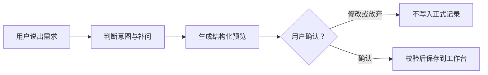

# 日常屿：项目讲解与下一步升级路线

更新日期：2026-10-02。本文是产品讲解与路线规划，不是新版 APK 发布公告。

[项目首页](../README.md) · [小红书宣传草案](./XIAOHONGSHU-20261002.md) · [AI 升级草稿 PR #7](https://github.com/me-fake-you/richangyu-life-workbench/pull/7) · [MIT 许可证](../LICENSE)

## 一句话介绍

日常屿是一个把待办、日程、生活记录和回顾放在一起的开源个人工作台。它希望让“准备做什么”和“已经发生了什么”相互连接，而不是让用户在多个工具之间反复搬运信息。

仓库公开，根目录采用 MIT 许可证。开源的是代码，不是维护者的个人数据、部署密钥或私人工作台访问权限。

## 先看清当前版本

| 部分 | 截至本文发布时的状态 |
| --- | --- |
| 仓库主分支 | 既有的 v1.5.0 移动优先工作台；当前提交只补充讲解文档，不发布新的软件版本 |
| AI 升级源码 | 在 [草稿 PR #7](https://github.com/me-fake-you/richangyu-life-workbench/pull/7)，尚未合并到主分支 |
| 个人线上部署 | 已接入 Groq 聊天记事与计划预览，并发布了后续保存提示修复；它不是对公众开放的体验站 |
| 公开代码与线上修复 | 不是自动同步；本次文档更新不把后续线上修复自动同步进 AI 草稿分支 |
| 手机体验 | 主分支提供 PWA；不能把可安装网页应用宣传成已完成的原生安卓正式版 |
| 安卓安装包与应用商店 | 本轮没有发布新版 APK，也没有完成商店上架 |
| 独立部署 | 需要按部署指南配置身份验证、数据库、对象存储与可选模型；公开源码不等于已经验证一键部署 |

当前文档不承诺所有旧模块都经过本轮全面复测。源码状态以对应分支和版本说明为准。

## 它具体能帮你做什么

| 你遇到的事 | 使用方式 |
| --- | --- |
| 今天要做什么 | 在“今日”查看待办与日程，给重要的事留时间 |
| 已经做完一件事 | 写成生活记录，留下内容、发生时间和感受 |
| 多条信息来不及整理 | 先放进收件箱，再逐条归类 |
| 想回看这一周 | 结合时间线、日历与回顾，区分计划和实际 |
| 想用自然语言安排或记事 | 使用 AI 升级流程补问、生成预览，再由用户确认 |

已有图文与视频入口：

- [逐步图文使用指南](./usage-guide.md)
- [仓库 README 中的三分钟讲解入口](../README.md#三分钟产品讲解)
- [数据与隐私说明](./data-and-privacy.md)
- [Cloudflare 独立部署指南](./deployment-cloudflare.md)

这些入口沿用仓库已有资料，本轮没有重新制作或复测视频。

## AI 不是直接替你乱写数据

以下都是虚构示例，不会因为阅读本文而写入任何工作台：

| 你说的话 | 应有的处理 |
| --- | --- |
| “明天下午两点到四点做兼职，帮我安排日程” | 整理为日程预览，核对日期和时间后确认 |
| “今天兼职已经做完，感觉很累，帮我记下来” | 整理为生活记录，而不是再安排一项未来任务 |
| “今天我做兼职” | 信息不足时补问，是已经做完还是准备去做 |
| “家教收入120元，还没到账” | 先单独授权发送金额信息，再区分待收款和已到账；未到账不等于账户余额 |

AI 负责理解和整理，程序负责校验，用户负责最后确认。模型一句“已经安排”不能代替数据库保存结果。

在近期个人线上检查中，普通生活记录的预览、确认保存和刷新后可见已经完成一次实际验证；“明天”“后天”的日程日期修改做过预览检查。财务确认写入、更多日程保存场景、独立部署和安卓真机流程仍需分别验证。后续保存标题修复已部署，但未再次完成完整保存复测。

## 免费 AI 与隐私边界

- 当前个人部署的聊天记事选择 Groq 免费方案，不自动切换到付费模型。
- “有免费额度”不等于“永久免费且无限调用”。Groq 按请求数与 Token 等维度限流，具体额度以账号控制台为准。[Groq 官方额度说明](https://console.groq.com/docs/rate-limits)
- 开源许可证不替维护者支付云服务、存储或其他模型供应商的费用。
- AI 默认接收本次输入及必要的最近对话，不默认读取整套私密记录、照片、账本或密码；日程上下文需按界面选择。
- 金额与兼职收入信息需要单独确认发送。不要在聊天中输入密码、验证码、证件号或 API 密钥。
- 发布截图只用独立演示环境里的虚构数据，不上传真实账本、照片、备份或环境配置。
- MIT 许可适用于仓库代码；第三方依赖、模型服务和素材仍按各自许可与条款使用。

## 下一步升级，不继续无节制堆模块

### 第一优先级：安卓真正可用与公开代码对齐

| 工作项 | 目标 | 完成标准 |
| --- | --- | --- |
| 公开源码对齐 | 同步线上近期修复到对应开发分支，清楚标明版本 | 有明确的变更与验证记录；不是仅靠文档宣称已完成 |
| 安卓端内登录与绑定 | 登录后仍能留在 App 内使用，同一身份连接同一套数据 | 登录、退出、过期重登录与手机电脑同步均有真机验证 |
| 可靠安装包 | 提供可识别、可下载、可安装且可持续升级的发布包 | 签名发布包、版本说明、校验信息与干净安装验证 |
| 弱网与离线 | 在已有 PWA 离线能力基础上覆盖安卓恢复场景 | 离线输入不会丢失，联网重试有清楚状态且不重复添加 |

原生安卓发布应构建并签名 release 版本；如果选择 Google Play，新应用发布还需准备 Android App Bundle。APK 直装与商店上架不是同一件事。[Android 官方发布说明](https://developer.android.com/studio/publish)

### 第二优先级：AI 可控与首页减负

- 预览可以直接修改标题、日期、时段和分类，不必每次重新描述。
- 对时间冲突给出可比较的调整方案，而不是强行覆盖现有安排。
- 建立清楚的撤销、修改与审计流程；财务操作不能与普通记录混用撤销承诺。
- 首页突出“今日、计划、记录”三个主入口，其余模块按场景收起。
- 统一未保存、保存中、已保存和失败状态，减少文案相互矛盾。
- 保留原有功能入口，不因简洁模式而静默删除数据。

### 第三优先级：长期可靠与宣传体验

- 扩展真实手机、权限提示、时区、重复提交和同步冲突的验证。
- 持续验证备份恢复，区分离线缓存与长期备份。
- 给公开演示准备独立的虚构数据环境，不开放个人生产工作台。
- 做一段聚焦“说一句话、看预览、确认保存”的短视频，再逐步邀请体验者。
- 根据实际使用反馈决定后续功能，不承诺尚未实现的协作、插件市场或全自动 AI。

## 现在适合怎样对外介绍

推荐：“一个持续完善中的 MIT 开源生活工作台，支持网页与 PWA，AI 升级采用先预览、后确认；原生安卓体验仍在打磨。”

不要说：“最新 AI 代码已经全部合并”“安卓版已经正式上架”“AI 永久无限免费”“无需授权自动读取全部私人数据”。

宣传目的可以是收集使用反馈与招募共同完善者，而不是把开发中的功能包装成已验证的正式产品。
