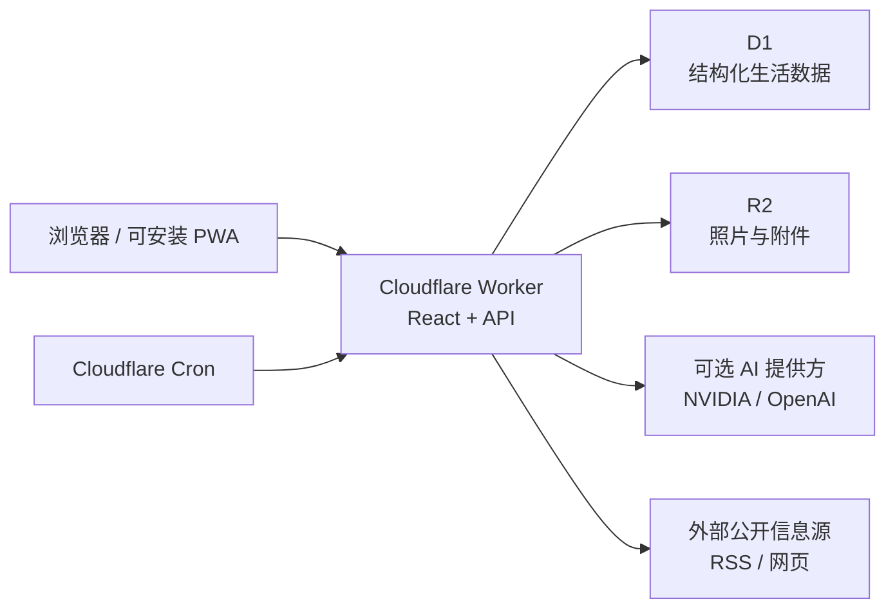

# 架构说明

## 总体结构

本地开发也使用相同的 Worker 接口和 D1/R2 绑定模型，由 Wrangler 提供本地资源。业务代码不会依赖某个具体的 Sites 项目 ID。

## 四层产品模型

1. **记录**：文字、照片、语音、文件、网页、心情、餐食和财务凭证。
2. **组织**：时间线、时间表、表格、项目、人物、地点、专题和工作台。
3. **理解**：搜索、统计、关系图谱、回顾、来源证据和 AI 辅助。
4. **行动**：任务、计划、提醒、自动化、目标拆解和智能安排。

所有模块尽量通过“生活事件”和关联实体连接，避免同一件事在课程、时间线、财务和总结中重复录入。

## 主要运行组件

### 客户端

- React 组件提供桌面和手机响应式界面。
- Service Worker 缓存应用壳并支持 PWA 安装。
- IndexedDB/本地存储保存待同步图文记录和设备同步状态。
- 客户端不应持有生产 API 密钥。

### Worker 与 API

- `worker/index.ts` 是 Cloudflare Worker 入口。
- `app/api/**/route.ts` 提供记录、媒体、时间表、表格、财务、回顾、备份和 AI 等接口。
- 定时触发器每 15 分钟唤醒自动化、AI 队列和备份检查；规则自身决定是否真正执行。

### D1

结构化数据由 D1 保存，Drizzle schema 位于 `db/schema.ts`，迁移位于 `drizzle/`。重要实体包括生活事件、附件、日程、表格/行/字段、财务交易、兼职项目与结算、自动化、情报订阅、回顾、备份和同步状态。

### R2

照片、语音、文档、票据和备份归档保存到 R2。数据库只保存对象键、元数据与业务关联。删除数据库记录时需要同时考虑对象清理和回收站策略。

### AI 提供方

AI 是可选增强层。文字和视觉模型可以使用不同密钥、不同模型。没有密钥时，普通 CRUD、统计和规则型功能仍应可用。

## 关键数据边界

- “发生时间”和“记录时间”分开保存，支持补记。
- “计划时长/时间”和“实际时长/时间”分开保存。
- 兼职 `WorkSession`、应收 `Receivable`、到账 `Settlement` 和真实账户交易 `Transaction` 不能合并。
- 私密内容在查询入口、总结、通知、往年今日和导出中分别执行隔离。
- AI 结果保存来源 ID，正式写入由用户确认。
- 导入先预览，恢复先校验，破坏性删除进入回收站并保留审计线索。

## 扩展方向

新增领域模块时优先复用生活事件、关联、附件、自定义表格、自动化和导出协议。这样宠物、植物、家居或收藏品等新场景不必复制整套基础设施。
