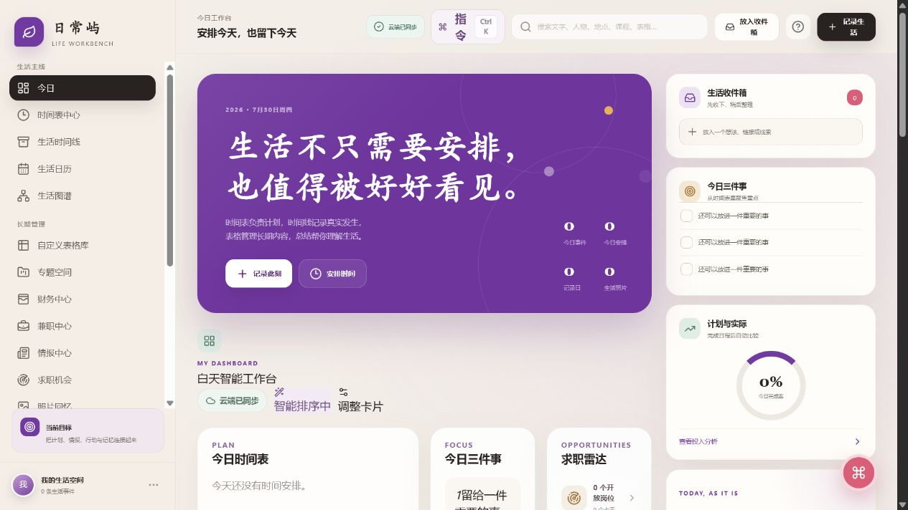
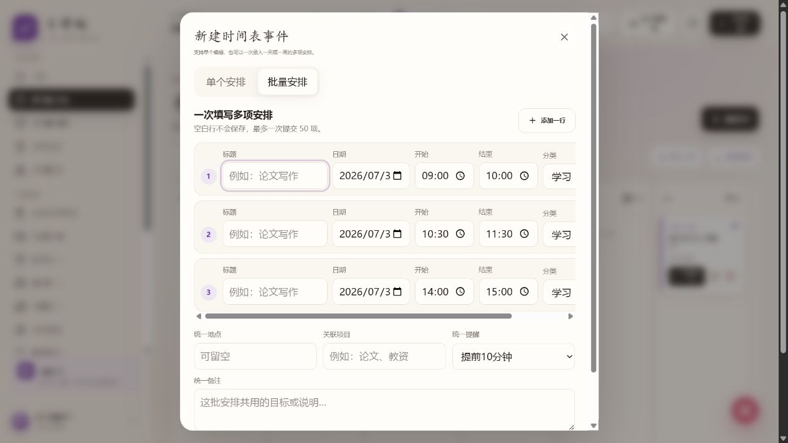
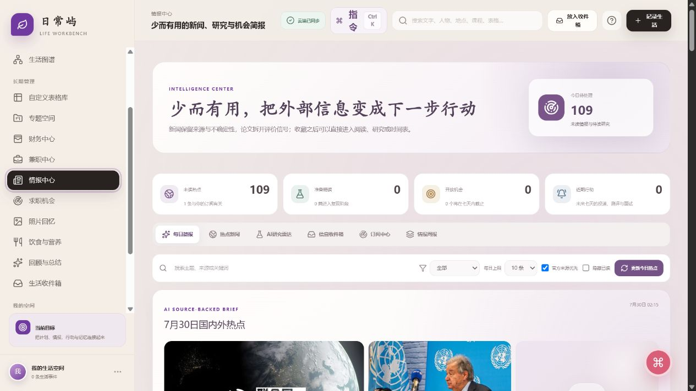
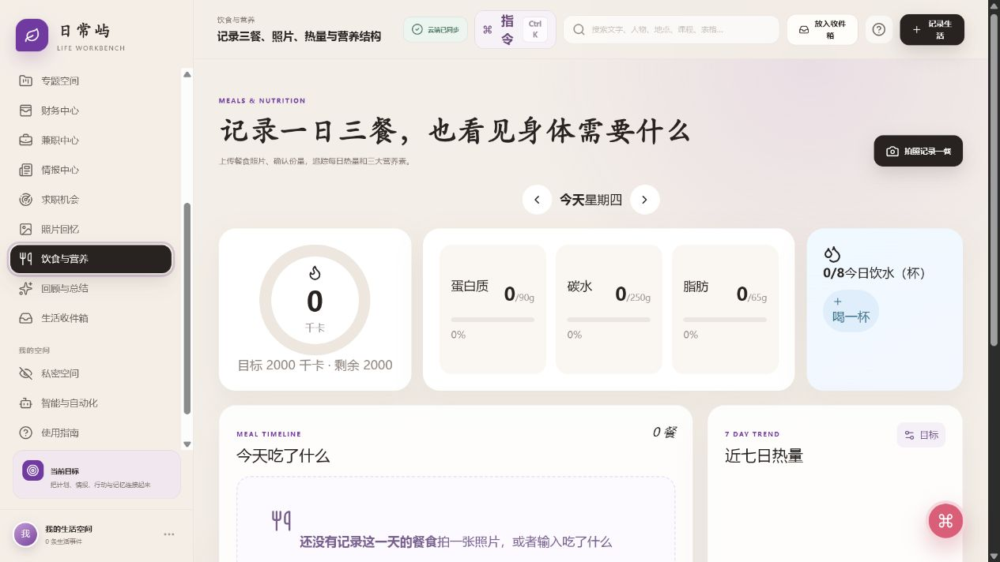
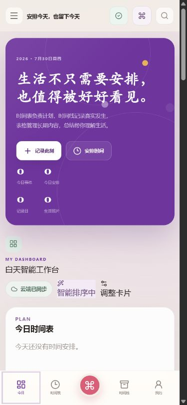
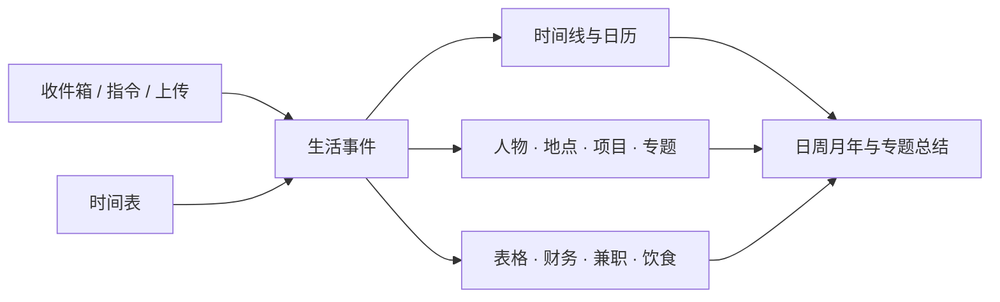

# 日常屿图文使用指南

这份指南适合第一次进入日常屿的用户。不要急着配置全部模块，先完成一次“记录—安排—回顾”即可。

[返回项目首页](../README.md) · [观看三分钟中文讲解视频](https://me-fake-you.github.io/richangyu-life-workbench/) · [下载 MP4](https://github.com/me-fake-you/richangyu-life-workbench/raw/refs/heads/main/public/tutorial/richangyu-quick-start.mp4) · [字幕与完整旁白](./video-script.md)

## 1. 先选择工作台模式

第一次进入建议打开“我的 → 工作台模式与场景”：

- **简洁模式**：日常只显示今日、时间表、时间线、回顾和收件箱；
- **完整模式**：侧栏直接显示全部模块；
- **场景预设**：日常、教师、科研、兼职、健康和财务只改变常用入口，不会复制或删除数据；
- 简洁模式下点击“查看全部功能”，随时可以临时展开完整系统。

这些偏好保存在云端，手机和电脑会读取同一模式。

## 2. 从今日工作台开始



今日页是每天的起点：

1. 阅读当天自动变化的激励文字；
2. 只选择三件真正重要的事；
3. 查看今日日程、照片、心情和计划完成情况；
4. 点击“记录生活”写文字、上传照片或补记过去发生的事情。

首页卡片可以添加、隐藏、折叠、调整宽度和拖动排序。手机与电脑登录同一账号后会读取同一份云端布局和生活数据。

## 3. 用时间表安排计划



进入“时间表中心”后：

- 点击“新建日程”建立单项安排；
- 切换到“批量安排”，一次录入一天或一周的多项课程、学习和工作；
- 点击已有日程的铅笔按钮，可以修改标题、时间、分类、提醒、地点、人物、项目和备注；
- 完成后填写实际开始时间、实际时长、完成结果和感受。

浏览器输入的时间会按照当前设备的本地时区保存。重复日程保存时会明确提示是否同步整个系列。

## 4. 让收件箱接住临时想法

来不及分类时，点击顶部“放入收件箱”：

- 保存一段文字或链接；
- 上传图片、语音或 PDF；
- 之后再整理为正式记录、日程、专题或表格内容。

积累多条后点击“逐条整理”，页面一次只显示一条线索，可以选择上一条、稍后、删除或转为生活事件，避免面对长列表无从下手。

断网时纯文字会先进入本机队列，联网后自动同步。照片、财务和私密数据不会进入公共离线缓存。

## 5. 用一句话完成多项记录

电脑按 `Ctrl/⌘ + K`。手机点击底部“＋”会先看到六个大入口：写一句话、拍照记录、语音随手记、记录饮食、先存收件箱和更多指令；长按“＋”会优先突出语音入口。只有复杂的跨模块操作才需要进入“更多指令”，并且总是先显示执行预览。

```text
午饭鸡肉饭，花了 32 元，心情不错
```

确认后会同时：

1. 把鸡肉饭写入“饮食与营养”，用文字或照片估算热量；
2. 把 32 元写入财务账本；
3. 把心情与原句写入生活时间线。

完成页仍可点击“撤销”。如果需要填写人物、地点、标签或更详细的营养数据，使用“完整记录”或进入对应模块继续编辑。

## 6. 阅读来源可核对的热点



情报中心不会让 AI 凭空编新闻。推荐流程是：

1. 点击“更新今日热点”读取公开信息源；
2. 查看国内、国际、研究和求职分类；
3. 打开原始来源核对日期、标题和关键事实；
4. 把有价值的信息转为阅读任务、研究专题或求职行动。

文章没有可用图片时会显示来源占位封面，不会使用无关图片冒充新闻配图。

## 7. 上传三餐照片并修正热量



进入“饮食与营养”后上传餐食照片，并补充看不清的食材、份量和烹饪方式。视觉模型可以估算：

- 食物名称和份量；
- 热量范围；
- 蛋白质、碳水和脂肪；
- 识别置信度和需要人工确认的部分。

照片无法准确判断油、糖和真实重量，因此务必人工确认。相关结果只用于日常记录，不能替代医生或注册营养师的意见。

## 8. 在手机上安装



### iPhone

1. 使用 Safari 打开部署网址；
2. 点击“分享”；
3. 选择“添加到主屏幕”；
4. 从桌面上的“日常屿”图标进入。

### Android

1. 使用 Chrome 或系统浏览器打开部署网址；
2. 打开浏览器菜单；
3. 选择“安装应用”或“添加到主屏幕”。

安装后长按图标，可以快速进入记录生活、安排日程、记录饮食和生活收件箱。

手机首次访问会出现安装提示，也可以进入“我的 → 手机应用体验”重新查看。日常使用建议：

1. 点击底部“＋”完成大多数即时记录；
2. 在“我的 → 工作台模式与场景”选择底部第五个业务入口；
3. 查看顶部的“已同步、离线、待同步或需处理”状态；
4. 时间表左右滑动切换日期，保存按钮固定在底部；
5. 从相册或浏览器使用系统“分享”，把内容送进生活收件箱。

断网重新打开时会使用不含个人数据的应用外壳。新建记录进入本机队列，联网后上传；AI、云端搜索和历史数据读取仍需要网络。

## 9. 每天最简单的使用节奏

- **早晨**：查看今日三件事和日程；
- **白天**：用收件箱或全局指令快速记录；
- **吃饭**：拍下餐食并确认份量；
- **晚上**：补充实际投入、照片和心情；
- **周末**：生成周总结草稿，回到原始记录检查后再保存。

## 10. 数据与隐私

- 私密记录不会进入普通首页、搜索、默认总结和往年今日；
- 私密空间切换到手机后台时会立即遮挡并重新锁定；
- 财务金额、客户资料和私密内容导出前需要单独确认；
- AI 内容写入正式数据前应由用户确认；
- 定期下载完整可移植备份，并至少实际做一次恢复预检；
- `.env.local`、真实照片、财务凭证和个人备份不能上传到公开 GitHub 仓库。

### 做一次真正可验证的备份

进入“我的”，找到“数据健康与恢复演练”：

1. 点击“重新体检”，检查数据库关联与附件原文件；
2. 点击“创建云端快照”，把数据清单和附件副本保存到私有对象存储；
3. 点击“恢复演练”，只读验证最近快照，不会改变正式内容；
4. 下载健康报告，保留检查时间、风险项和备份状态；
5. 仍应定期下载“完整可移植备份”，保存到自己控制的另一台设备。

### 第一次体验时使用安全演示

同一页面的“安全演示模式”可以加入完全虚构的记录、日程、表格、账目、兼职、应收和餐食。演示完成后点击“安全重置演示”；系统只删除固定演示前缀的数据，真实内容不会被清理。

## 11. 财务与兼职怎样正确联动

财务和兼职看起来都涉及金额，但底层含义不同：

| 数据 | 回答的问题 | 何时产生 |
| --- | --- | --- |
| 兼职打卡 | 做了什么、花了多久？ | 开始/结束工作或手动补录 |
| 应收款 | 这次工作应该收到多少？ | 完成工作后 |
| 结算 | 实际收到多少、何时收到？ | 客户付款后 |
| 财务交易 | 钱真正进入哪个账户？ | 结算确认到账后 |

例如完成三小时家教、应赚 600 元但尚未付款时，兼职项目增加三小时，应收款增加 600 元，财务账户仍不增加收入。家长付款后确认结算，系统才创建真实收入交易。

交通、材料、平台手续费和通勤等成本应关联到兼职项目。系统据此计算：

```text
净利润 = 实际收入 - 项目成本
有效时薪 = 净利润 ÷ 全部实际投入时间
```

## 12. 所有模块怎样连接

日常屿的核心不是页面数量，而是“生活事件 + 关联”：



一次课程可以同时出现在时间表、教学表、当天时间线、学期专题和周总结中，但不需要复制五次。正确做法是记录一次，再建立关联。

## 13. 第一周建议

| 时间 | 只做这一件事 | 目的 |
| --- | --- | --- |
| 第 1 天 | 记录一件真实发生的事，安排明天一段时间 | 完成最小闭环 |
| 第 2—3 天 | 用收件箱保存来不及整理的文字、照片和链接 | 降低记录压力 |
| 第 4—5 天 | 日程结束后补充实际时长、结果和感受 | 建立真实数据 |
| 第 6 天 | 创建一个专题或复制一张表格模板 | 开始长期组织 |
| 第 7 天 | 生成周总结、核对来源、下载完整备份 | 第一次回顾与保护数据 |

不要在第一天同时配置课程、财务、兼职、求职、自动化和所有表格。先让“记录—安排—回顾”稳定发生，再增加真正需要的模块。

## 14. AI 配置与边界

AI 不是核心数据存储，也不应该替你自动决定什么是真的。

- 文字模型：标题、标签、总结、指令理解和资料整理；
- 视觉模型：餐食、票据、截图和文档图片识别；
- 两类模型可以使用两把不同密钥和不同模型；
- 没有任何 AI 密钥时，普通记录、日程、表格、财务和统计仍可使用；
- AI 结果要显示来源、模型和置信信息，用户确认后才写入正式数据；
- 饮食估算不能代替医疗诊断，新闻摘要不能代替原始来源。

密钥只填写在本地 `.env.local` 或部署平台的服务端环境变量中，不能填写到网页表单、客户端代码、README 或 GitHub Issue。

## 15. 常见问题

### 手机和电脑为什么没有同步？

确认两端访问的是同一个部署网址，并通过同一身份进入。还要确认线上部署绑定的是同一套 D1/R2；`localhost` 本地开发数据不会自动同步到线上。

在“我的 → 跨设备同步中心”可以查看本机设备号、网络类型、离线附件体积、最早等待时间、上次成功同步与云端回执。失败项可以批量重试；版本冲突仍需选择“本机另存”或保留云端，系统不会静默覆盖。

### 电脑关机后手机还能使用吗？

只要访问的是已经部署的线上网址，网站、D1 数据库、R2 照片、AI 配置和云端定时任务都不依赖个人电脑，电脑关机后仍可使用。`localhost` 本地开发地址会随电脑关机停止。

### 为什么餐食热量不准确？

照片无法准确判断克重、用油、糖、酱料和被遮挡的食物。请补充份量与烹饪方式，并手动修正识别结果。

### 为什么热点没有摘要或图片？

先打开原始来源确认网络是否可访问。部分网站没有 RSS 图片、禁止抓取或只提供摘要，系统会显示来源占位图，不会用无关图片冒充。

### 离线队列是不是备份？

不是。离线队列只用于临时断网后的待同步记录。长期保护数据必须依赖云端存储、定期导出、备份校验和实际恢复演练。

### 能否把它当成原生手机 App？

当前是 PWA，可安装到主屏幕并以独立窗口运行，但不是应用商店中的原生 APK/IPA。它的优点是更新快、电脑手机共用一套界面；后台能力仍受手机浏览器限制。

### 下一步从哪里开始？

如果今天尚未记录任何内容：回到“今日”，记录一件真实发生的事。

如果已经记录但很混乱：先整理收件箱，再建立一个专题。

如果记录很多却没有反馈：补充计划与实际，生成第一份周总结。
